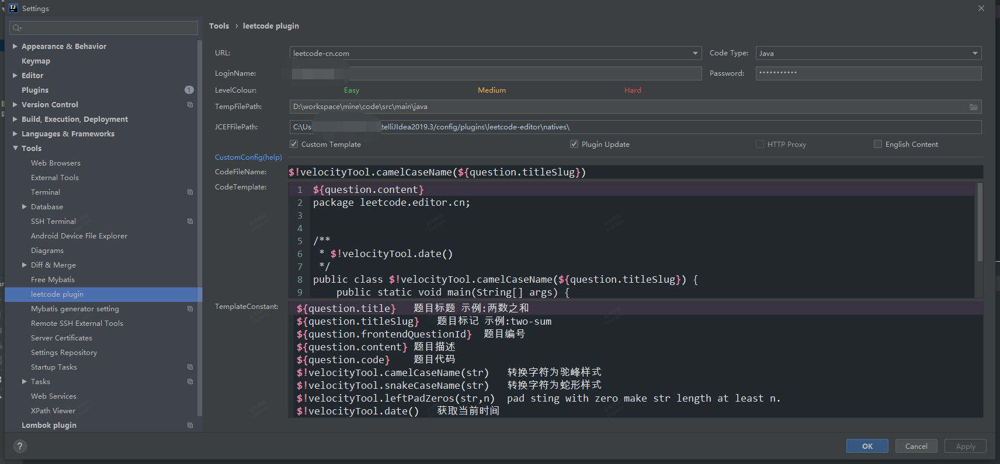

* leetcode配置：

> 双击题目时会自动在TempFilePath配置路径下创建 leetcode/editor/cn 文件夹，故codeTemplate配置package时应多加上配置： .leetcode.editor.cn

* codeFileName: 
> $!velocityTool.camelCaseName(${question.titleSlug})

* codeTemplate:

${question.content}
package leetcode.editor.cn;

/**
 * $!velocityTool.date()
 */
public class $!velocityTool.camelCaseName(${question.titleSlug}) {

    public static void main(String[] args) {
        Solution solution = new $!velocityTool.camelCaseName(${question.titleSlug})().new Solution();
        //TODO
    }

    ${question.code}
}