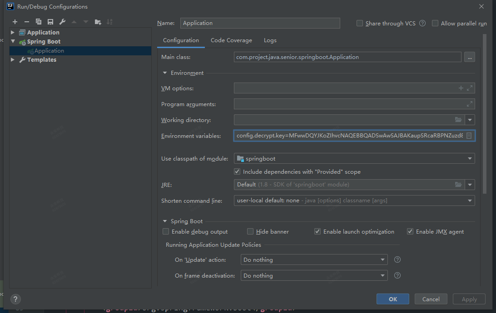

使用mybatis逆向工程生成对应pojo以及mapper文件方法：
在Maven Projects -- springboot -- Plugins -- mybatis-generator下双击执行mybatis-generator.generate

启动时设置环境变量：

数据库密码：
* 明文密码: qwer1234
* 私钥: MIIBVAIBADANBgkqhkiG9w0BAQEFAASCAT4wggE6AgEAAkEApq6lJFxpEE81m7N3xAKKEvcSc2SsplOuecq/WUq4xZHa5ctZgKZ7/CiPuv0Y3RsGSjLJ819oS1XHqtRdWTDrRQIDAQABAkBl87EDOprw5OIvaGi7Napqy0E3375SxiCUUlUUMsYt4XfqDsggCchdKShsVcbYUnL36wQe/nn7sdf9l25sKMwBAiEA7MVJWW4xSlPdjpRszcwrA3RoovOEstUpLbnIB6h1lMUCIQC0OCU05OLOKoMXZA/orbzckPVjG2AWEm9AHa3bLcRkgQIga+vA8zJ25Ro08rhUn7lgIcL9rsiww5LFokH8GwF+FsECIDWz2Vp2riMzRdcNiTQTuYicZZL/0FUjbyVS8sCyVaiBAiEAqPJ1ZBRX/r0yb9AoLuYwMd9JsD2ZbAQszdNdAVla4vg=
* 公钥: MFwwDQYJKoZIhvcNAQEBBQADSwAwSAJBAKaupSRcaRBPNZuzd8QCihL3EnNkrKZTrnnKv1lKuMWR2uXLWYCme/woj7r9GN0bBkoyyfNfaEtVx6rUXVkw60UCAwEAAQ==
* 加密后的密码: eAjJfxS+2KTELRqsjm6hNNVOJ5bAe7y8LtpDkswvNof+r2h967SD5APzta0U7cyH22goZdEWMGQaMK4nMTh2Gg==
* 解密后: qwer1234

环境变量配置：
> config.decrypt.key=MFwwDQYJKoZIhvcNAQEBBQADSwAwSAJBAKaupSRcaRBPNZuzd8QCihL3EnNkrKZTrnnKv1lKuMWR2uXLWYCme/woj7r9GN0bBkoyyfNfaEtVx6rUXVkw60UCAwEAAQ==
> string.encrypt.salt=java_123456

批处理模块参考文献：
> https://blog.csdn.net/wuzhiwei549/article/details/85394406

